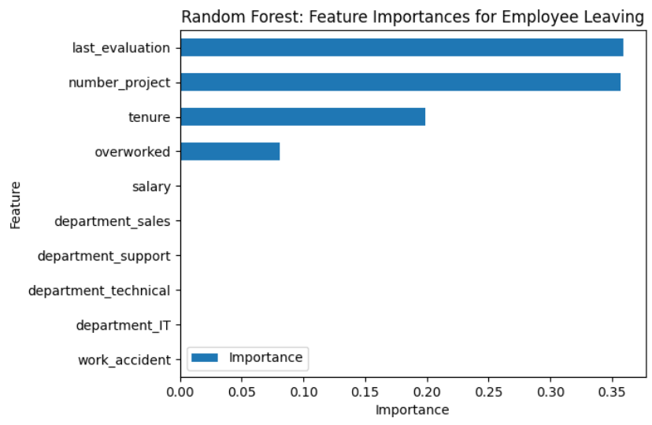

# employee-attrition-prediction-salifort
This repository contains a Machine Learning project predicting employee attrition using data analysis, feature engineering, and classification models.

# Employee Attrition Prediction using Machine Learning (Salifort Motors)

## 📌 Project Overview

This project develops a predictive machine learning model to identify employees at risk of attrition. Using HR analytics and employee behavioral data, the project uncovers key drivers of employee turnover and provides actionable insights to improve retention strategies.

## 🎯 Business Problem

High employee attrition leads to increased hiring costs, productivity loss, and operational inefficiencies.
The objective is to leverage data-driven insights to **predict employee attrition** and support proactive retention decisions at Salifort Motors.

---

## 📊 Dataset Description

* HR analytics dataset containing employee-level data
* Features include:

  * Department
  * Number of projects
  * Average monthly hours
  * Tenure
  * Salary level
  * Work evaluation metrics

---

## 🔍 Exploratory Data Analysis (EDA)

* Performed data cleaning, handling missing values, and duplicate removal
* Detected and analyzed **outliers in tenure and workload variables**
* Explored relationships between employee workload, tenure, and attrition
* Identified **imbalanced distribution of employees leaving vs staying**

---

## 📈 Key Insights

*It appears that employees are leaving the company as a result of poor management.

*Leaving is tied to longer working hours, many projects, and generally lower satisfaction levels. It can be
ungratifying to work long hours and not receive promotions or good evaluation scores. 

*There’s a sizeable group of employees at this company who are probably burned out.

*It also appears that if an employee has spent more than six years at the company, they tend not to leave.

---

## 🤖 Machine Learning Model

* **Model Type:** Tree-based Machine Learning (Decision Tree and Random Forest)

* **Techniques Used:**

  * Feature Engineering
  * Data Preprocessing
  * Model Training & Validation
  * Performance Evaluation

* **Evaluation Metrics:**

  * Accuracy: 96.2%%
  * Recall: 90.4%
  * Precision: 87.0%
  * AUC: 93.8%
  * F1-score of 88.7%

---

## 📊 Model Insights

* Workload-related features (projects, hours) are among the **top predictors of attrition**
* Tenure and salary significantly influence model predictions
* Behavioral patterns are more predictive than static attributes

---

## 📣 Business Recommendations

• Cap the number of projects that employees can work on.

• Consider promoting employees who have been with the company for atleast four years, or
conduct further investigation about why four-year tenured employees are so dissatisfied.

• Either reward employees for working longer hours, or don’t require them to do so.

• If employees aren’t familiar with the company’s overtime pay policies, inform them about
this. If the expectations around workload and time off aren’t explicit, make them clear.

• Hold company-wide and within-team discussions to understand and address the company
work culture, across the board and in specific contexts.

• Highevaluation scores should not be reserved for employees who work 200+ hours per month.
Consider a proportionate scale for rewarding employees who contribute more/put in more
effort.

---

## 📁 Project Files

* [📓 ML Notebook](notebooks/employee_attrition_prediction_model.ipynb)

---

## 🚀 Tools & Technologies

Python | Pandas | NumPy | Matplotlib | Scikit-learn | Machine Learning | Data Analysis | Predictive Modeling

---

## 🔑 Keywords

Employee Attrition | HR Analytics | Predictive Modeling | Machine Learning | Classification | Feature Engineering | Data Analysis | Workforce Analytics

